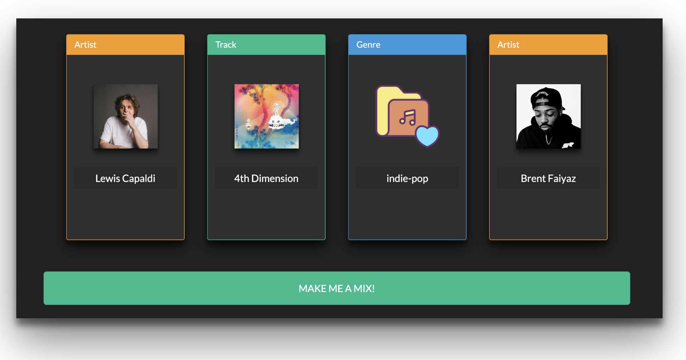
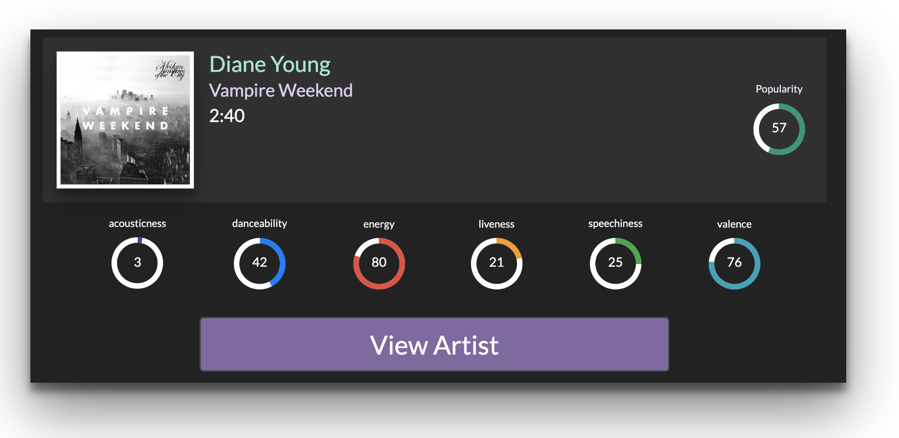
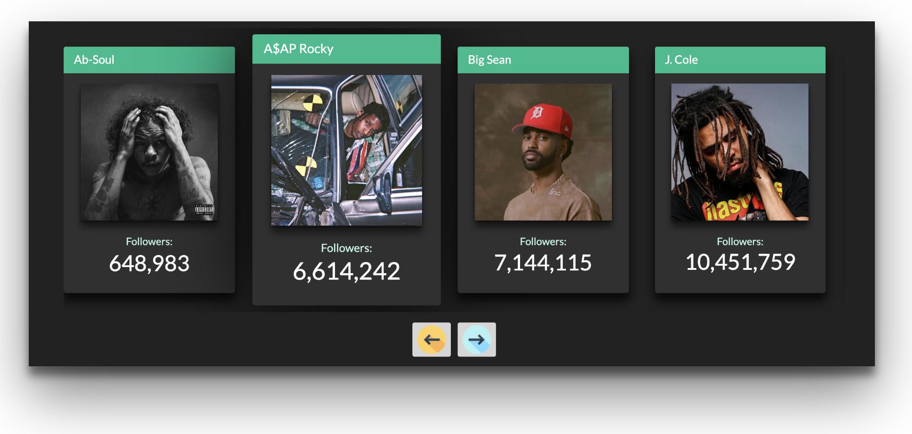

<h1 align="center">
  MusicDex
</h1>

MusicDex is a web application designed to provide users with an endless stream of new music based on their own tastes. Through a set of endpoints provided by [Spotify's Web API](https://developer.spotify.com/documentation/web-api/), users can add a combination of artists, tracks and genres to their mixture to generate a playlist of tracks that they'd find enjoyable. 

Built with Angular 8 and Bootstrap, MusicDex is designed to be modernized, beautiful, and quick.


<h4 align="center">Start mixing now! Visit the project at https://newsic.netlify.com/</h4>

<h2>Features</h2>

| **Add endless permutations of artists, tracks and genres to your musical mixture to create a playlist of tracks fine-tuned to your unique musical palette.** |
|:--:| 
|  | 

| **View audio features about your favourite tracks, such as energy, valence, and even danceability.** |
|:--:| 
|  | 

| **Discover up to 20 new artists for each of the musicians you love and listen to daily** |
|:--:| 
|  | 

<h2>Development</h2>

* Follow the [Angular Tutorial](https://angular.io/guide/setup-local) to get your work environment set up
* Clone the repository ```https://github.com/Fraisin/MusicDex.git```
* Run ```npm install``` to install the required dependencies
* Run ```ng serve``` to start a dev server 
* Navigate to ```http://localhost:4200/``` in a brower to view your changes in real-time

<h2>Built With</h2>

* [Angular 8.3.23](https://github.com/angular/angular-cli)
* HTML, CSS, Typescript, Bootstrap

<h2>Plugins</h2>

* [Owl Carousel 2.3.4](https://owlcarousel2.github.io/OwlCarousel2/)
* [Local Storage for Angular](https://github.com/cyrilletuzi/angular-async-local-storage)
* [ngx-select-dropdown](https://github.com/manishjanky/ngx-select-dropdown)
